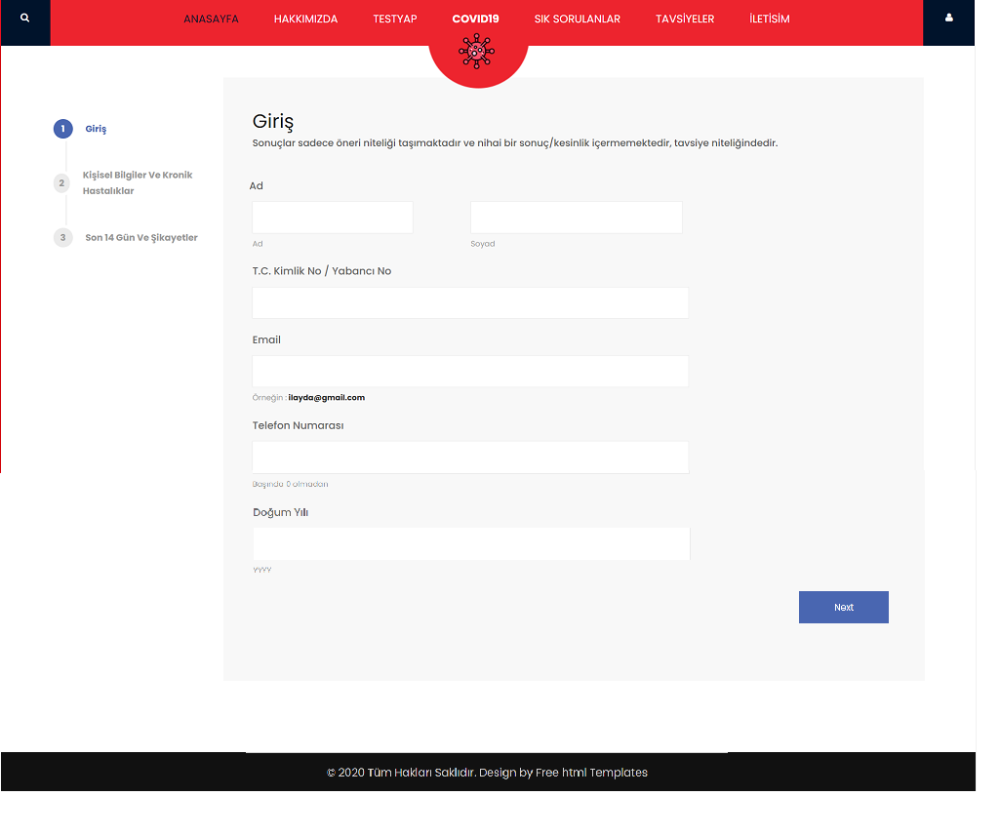
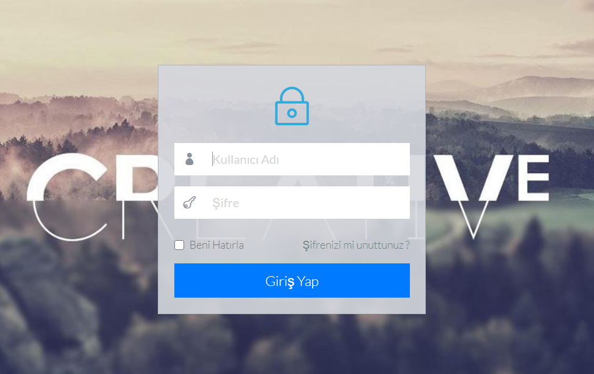

# .Net-Framework-MVC-CovidBilgilendirme
</img> 
<ul>
  <li>Kullanıcının covid-19 hakkında bilgi edinmesini,</li>
  <li>Kullanıcının Türkiye toplam ve günlük korona tablosunu görebilmesini,</li>
  <li>Kullanıcının Online korona testi yaptırmasını sağlar.</li>
</ul>

<h2>Covid-19 Türkiye Genel Tablo</h2>
</img> 

<h2>Hakkımızda</h2>
</img> 

<h2>Test Yap</h2>
</img> 
<h4>Test Sonucu</h4>
Test sonucu bulurken ML.net kullanılmıştır. 
<strong>------------------------------Pozitif--------------------------------------------------------------------Negatif----------------------------------</strong> 
</img> 

<h2>Sık Sorulanlar</h2>
</img> 

<h2>Tavsiyeler</h2>
</img> 

<h2>İletişim</h2>
</img> 

<h2>Admin</h2>
</img> 

<h2>Admin Login</h2>
</img> 

<h2>Veri Tabanı Diyagramı </h2>
</img> 
